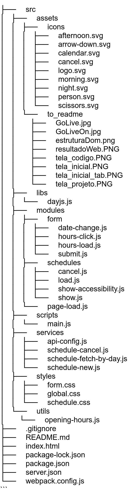

# 💈 Projeto Hair Day: Agendamento Acessível (A11Y)

-yellow)


Projeto de agendamento de horários focado na prática de JavaScript, refatorado com ênfase total em **Acessibilidade Web (A11Y)** para garantir uma experiência 100% funcional via teclado e leitor de tela.

---

## 🏁 Status do Projeto

> 📦 **Concluído (fase base)**  


> ♿ **Em refatoração com foco em A11Y**

---

## 🔗 Deploy

### 🚀 **Acesse a aplicação funcional aqui:** [https://rocketseat-full-stack...vercel.app/](https://rocketseat-full-stack-desafio-pratico-hair-day-m6c-quozl8wz0.vercel.app)

---

## 🎬 Demonstração da Acessibilidade

O maior ganho deste projeto foi garantir que a interatividade funcionasse 100% via teclado, o que é a base para a acessibilidade.


<p align="center">
    
</p>

---

## 📚 Contexto e Foco em Acessibilidade (A11Y)

Este projeto foi desenvolvido como desafio final do módulo de JavaScript da trilha **FullStack da Rocketseat**. O escopo original era construir a lógica de agendamento e cancelamento em JavaScript (ES6+), consumindo uma API local (`json-server`) e usando Webpack.

Após concluir a funcionalidade base, iniciei o **desafio pessoal de refatorar 100% do projeto com foco em Acessibilidade (A11Y)**. O componente original, baseado em `<li>`, era completamente inacessível para navegação por teclado.

Esta refatoração foi uma depuração complexa para garantir que a aplicação pudesse ser usada por todos, resolvendo desafios de gerenciamento de foco, semântica e até mesmo bugs de ambiente (HMR) causados pela UI otimista.

---

## 🛠️ Funcionalidades Técnicas e Conceitos de A11Y


Aqui está o detalhamento das soluções implementadas para tornar este componente robusto e acessível:


| Recurso | Descrição da Implementação | Aplicado |

| :--- | :--- | :--- |

| **HTML Semântico** | Uso de `<fieldset>` e `<legend>` para agrupar semanticamente os horários, informando aos leitores de tela que se trata de um grupo de opções. | ✅ |

| **Componente Acessível (`radiogroup`)** | Refatoração de `<li>` (não interativos) para `<input type="radio">` nativos, permitindo a seleção via `Espaço` e navegação com setas. | ✅ |

| **Gerenciamento de Foco (Teclado)** | Lógica de JavaScript que atribui `tabindex="0"` dinamicamente ao *primeiro* horário disponível e `tabindex="-1"` aos demais, garantindo um ponto de entrada lógico para a tecla `Tab`. | ✅ |

| **CSS Overlay Acessível** | Técnica de CSS (`opacity: 0`, `position: absolute`, `z-index`) para esconder visualmente o `input` de rádio, mantendo-o 100% focável e clicável. | ✅ |

| **CSS Moderno (`:has()`)** | Uso da pseudo-classe `:has()` para estilizar o `label` (pai) quando o `input` (filho) recebe `:focus-visible` ou `:checked`. | ✅ |

| **Botões Semânticos** | Refatoração do "X" de cancelar (uma ``) para um `<button>` real, tornando-o focável por `Tab` e ativável por `Enter`/`Espaço`. | ✅ |

| **Atributos ARIA** | Uso de `role="radiogroup"` para definir o container e `aria-label` dinâmico para os botões de cancelar (ex: "Cancelar agendamento de Ricardo..."). | ✅ |

| **UI Otimista (UX)** | Implementação de lógica no `submit.js` para adicionar (`appendChild`) e remover o item da lista visualmente no *front-end* (para a API "read-only"), simulando persistência de dados. | ✅ |

| **Prevenção de Bugs (HMR)** | Implementação de uma "guarda global" (`window.currentSubmitHandler`) para gerenciar a referência do *event listener* e impedir anexações duplicadas causadas pelo Hot Module Replacement (HMR) do Webpack. | ✅ |

---

## 🧠 Estrutura do DOM

A organização hierárquica foi pensada para garantir uma navegação lógica e clara para tecnologias assistivas, com marcos (landmarks) bem definidos.

<p align="center">
    
</p>

---

## 🧩 Tecnologias Utilizadas

* **HTML5 Semântico**

* **CSS3** (Flexbox, Grid, Variáveis, `:has()`)

* **JavaScript (ES6+)** (Async/Await, Manipulação de DOM, Event Listeners)

* **Webpack** (Bundler, HMR, Dev Server)

* **JSON-Server** (API local para desenvolvimento)

* **My JSON Server** (API pública "read-only" para deploy)

* **Vercel** (Deploy contínuo - CI/CD)

---

## 🧭 Rodando o Projeto Localmente

Este projeto usa Webpack e JSON-Server.

1.  **Clone o repositório:**

    ```bash
    git clone https://github.com/ricardo-werner/Rocketseat_FullStack_Desafio_Pratico_Hair-Day.git
    ```

2.  **Instale as dependências:**

    ```bash
    npm install
    ```

3.  **Inicie a API local (JSON-Server):**

    *(Em um terminal)*

    ```bash
    npm run server
    ```
    *Isso iniciará o `json-server` em `http://localhost:3333`*


4.  **Inicie o projeto (Webpack Dev Server):**

    *(Em um segundo terminal)*

    ```bash
    npm run dev
    ```

    *O projeto abrirá automaticamente em `http://localhost:3000`*

---

## 🙋‍♂️ Sobre o Autor

**Ricardo Werner**

Desenvolvedor **Front-end & Acessibilidade (A11Y) & UX Inclusivo**, com mais de 30 anos em Negócios e Gestão

**Meu foco principal é o estudo, aplicação com o objetivo de construir soluções digitais que sejam verdadeiramente inclusivas, acessíveis e que tenham um propósito real.**

📫 **Conecte-se comigo:**
<p align="center">
    <a href="https://linkedin.com/in/ricardo-werner" style="margin-right: 10px;">
        
    </a>
    <span style="display:inline-block; width:10px;"></span>
    <a href="https://www.github.com/ricardo-werner">
        
    </a>
</p>
